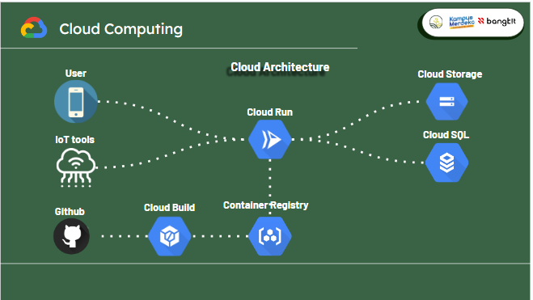

# Capstone Project API

Using Flask to build a Restful API Server with Swagger document.

Integration with Flask-smorest, Flask-GoogleStorage, Flask-SQLalchemy,and Flask-jwt-exended extensions.

### Requirements:

- Python 3 : [Python](https://www.python.org/)
- Env : See env example
- Database : Make the database to store data
- cloudbuild.yaml (for deployment)
- Dockerfile (for deployment)

### Extension:

- Smorest: [Flask-smorest](https://flask-smorest.readthedocs.io/en/latest/)

- SQL ORM: [Flask-SQLalchemy](https://flask-sqlalchemy.palletsprojects.com/en/3.0.x/)

- Google Cloud Storage: [Flask-GoogleStorage](https://flask-googlestorage.readthedocs.io/en/latest/)

- Jwt: [Flask-JWT-Extended](https://flask-jwt-extended.readthedocs.io/en/stable/)

## Installation

Create an environment:

```
py -3 -m venv .venv
```

Activate the environment:

```
.venv\Scripts\activate
```

Install with pip:

```
pip install -r requirements.txt
```

## Run Flask

### Run flask for develop

```
$ flask run
```

In flask, Default port is `5000`

Swagger document page: `http://127.0.0.1:5000/api/v1/swagger-ui`

### Deployment

```
git checkout doss
git push origin doss
```

Deployment automatic using cloud build, and the triger is 'push to branch doss'
make cure the database config use Google cloud config

## Configuration

### Development Database config

```
SQLALCHEMY_DATABASE_URI = ("mysql+pymysql://" + USERNAME + ":" + PASSWORD + "@" + HOST + "/" + DATABASE)
```

### Deployment Database config

```
from util.config import getconn
app.config["SQLALCHEMY_ENGINE_OPTIONS"] = {"creator": getconn}

### Jwt config
```

JWT_SECRET_KEY = "???"
JWT_TOKEN_LOCATION = ["headers"]
JWT_HEADER_NAME = "Authorization"
JWT_HEADER_TYPE = "Bearer"

## License

This project is licensed under the terms of the MIT license. See [LICENSE](https://github.com/yovixtar/myapps-privacy-policy/blob/main/privacy-policy-taniland.md) for more details.

# Capstone Google Cloud Architecture



Our project on Google Cloud incorporates various technologies to optimize its architecture. We utilize Flask, a Python web framework, for developing the API. To ensure smooth deployment, we rely on Cloud Run, a serverless platform for containerized applications. For structured data storage, we employ Cloud SQL, a scalable and highly available relational database service. Cloud Storage is utilized for storing unstructured data, offering a cost-effective and reliable solution. Streamlining the deployment process to Cloud Run is achieved through Cloud Build, a versatile service for building, testing, and deploying applications

## Step to make our deployment to google cloud

### Create cloud sql instance for storing

To store our structured data, we utilize Cloud SQL MySQL. For the sake of convenience, we have configured our Cloud SQL instance to be publicly accessible. The specifications of our instance are as follows:

- vCPUs: 1
- Memory: 614.4 MB
- SSD storage: 10GB.

Please note that these specifications define the configuration of our Cloud SQL instance.

### Create cloud storage

For the purpose of storing image data in our project, such as land images, PDF report files, and other related needs, we utilize Cloud Storage buckets. The configuration of our Cloud Storage is as follows:

- Public access status: Public to internet
- Encryption type: Google-managed key
- Default storage class: Standard

Please note that these settings define the configuration of our Cloud Storage bucket, ensuring accessibility and security for our stored data.

### Create cloud run

For the deployment of our project, we utilize the serverless platform Cloud Run due to its high scalability and ease of use. The specifications of our service are as follows:

- Memory: 1GB
- CPU: 1
- Maximum instances: 2
- Cloud SQL instance: deploy-minggu-3:asia-southeast2:minggu-3-sql

These specifications define the configuration of our deployed service, ensuring optimal resource allocation and utilization for efficient and scalable execution.

### Create cloud build

For the purpose of automation during deployment and its ease of use, we utilize Cloud Build to handle these tasks. The specifications of our Cloud Build setup are as follows:

- Trigger event: Push to a branch
- Source: 1st gen
- Repository: https://github.com/riskihia/capstone-project
- Branch trigger: doss
- Cloud Build configuration file: /cloudbuild.yaml

These specifications define the configuration of our Cloud Build setup, allowing us to automate the deployment process based on repository changes and execute the defined actions outlined in the cloudbuild.yaml configuration file.

### Container registry

To store our application's Docker image, we utilize the Container Registry. This allows us to securely store the image, which will be used by our Cloud Run service for deployment.

The Container Registry serves as a reliable and scalable storage solution for our Docker images, ensuring accessibility and ease of use for the deployment process. By leveraging the Container Registry, we can seamlessly integrate our stored images with the Cloud Run service, facilitating efficient and smooth deployments.

### Conclusion

The current deployment we are using is sufficient to run the API service in our project. However, we recognize the need for further improvement and enhancement.

To ensure optimal performance and scalability, we are actively exploring opportunities for advancement in our deployment strategy. This includes evaluating potential optimizations, adopting advanced technologies, and implementing best practices to enhance the overall reliability, efficiency, and responsiveness of our API service.

By continuously seeking improvements, we aim to provide an even better user experience and accommodate future growth and demands on our project.
